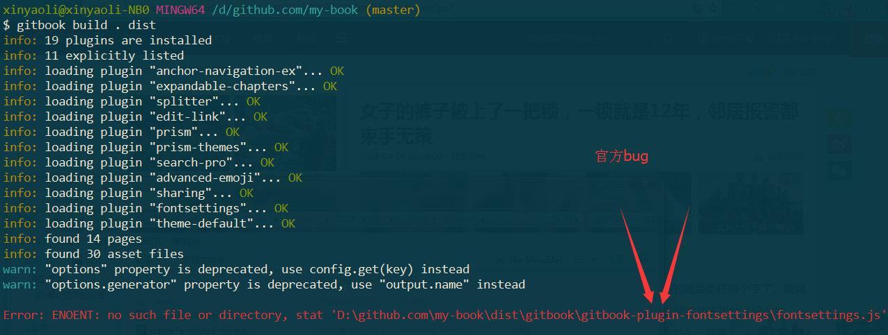
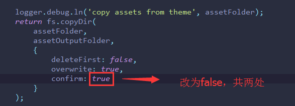
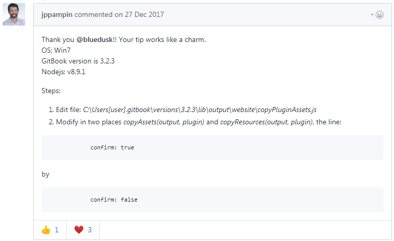

# 解决gitbook编译命令错误

## 问题描述

使用`gitbook serve .`或`gitbook build . dist`编译命令时，经常出现如下错误。

## 解决方法

修改文件`copyPluginAssets.js`

## 参考

- [gitbook/issues/1309](https://github.com/GitbookIO/gitbook/issues/1309)

