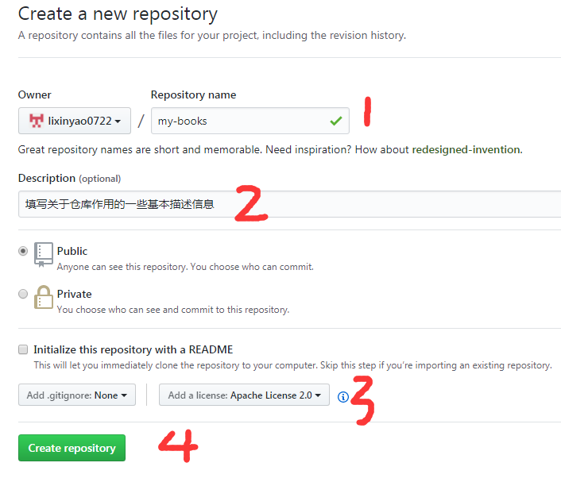

# Git Book基本使用

## 创建git book流程

1 在Github上创建一个新仓库，这个仓库就是用来存放git book文件。  


2 git clone项目到本地，同时创建gh-pages分支。

```bash
# 克隆代码到本地
git clone https://github.com/lixinyao0722/my-book

# 创建gh-pages分支
git branch gh-pages

# 切换分支
git checkout gh-pages

# 将分支关联远程仓库，并发布
git push --set-upstream origin gh-pages
```

>第一次创建分支push到远程时，需要添加`--set-upstream`参数设置远程的跟踪分支。

>主要使用两个分支  
>master分支：存放xxx.md等源码文件。  
>gh-pages分支：存放通过gitbook生成的静态页面文件，同时该分支支持
>{username}.github.io域名的访问。

3
安装gitbook命令行工具，gitbook-cli根据xxx.md源文件生成html文件或其他pdf格式等。

```bash
npm i -g gitbook-cli
```

4 安装gh-pages命令行工具，可以快速将某个目录直接发布到远程gh-pages分支上。

```bash
npm i -g gh-pages
```

5 在my-book目录下，需创建两个基本文件。
>SUMMARY.md 特殊导航文件  
>README.md

创建方式：  
5.1 手动创建  
5.2 gitbook cli创建

```bash
gitbook init
```

6 在master分支上md文件编写完毕后，可在本地启动临时服务器查看效果。

```bash
# 不加调试参数容易出现各种error
gitbook serve .

# 加上参数大大降低gitbook命令出错率
gitbook serve . --log=debug --debug
```

查看地址：http://localhost:4000

7 确认无误后，通过gitbook build生成html文件

```bash
# gitbook build {源文件夹} {目标文件夹}
gitbook build . dist
```

8 通过gh-pages命令行将目标文件夹发布远程仓库

```bash
gh-pages -d dist
```

dist/xxx 目录文件对应发布至 -> https://github.com/lixinyao0722/my-book/xxx

9 在线查看效果，地址http://lixinyao0722.github.io/my-book/index.html

## 参考

* [Gitbook命令行速览](http://yuzeshan.gitbooks.io/gitbook-studying/content/)
* [gitbook入门教程.pdf](../assets/resources/gitbook入门教程.pdf)

