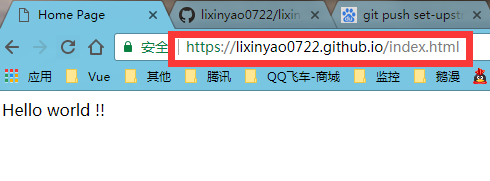
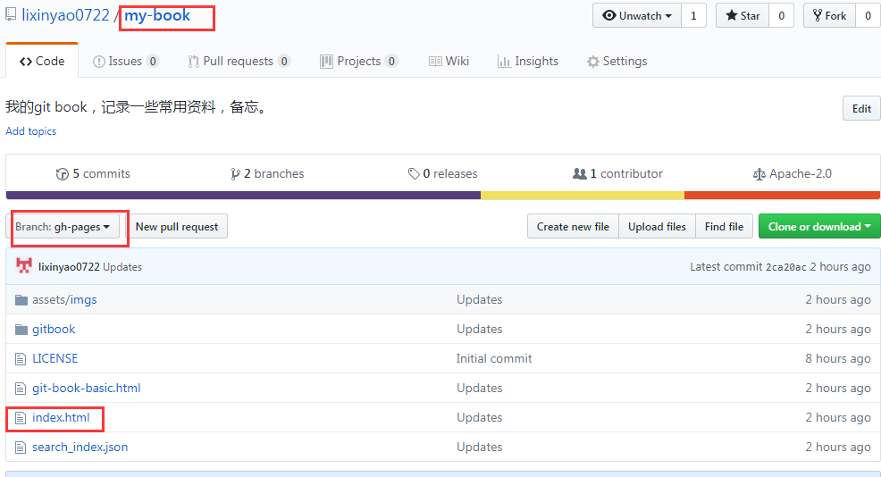

# Github静态域名

## 1 创建和使用

为了能够在github上发布静态网页，需要创建一个特殊的仓库。  
其名字为

```
{username}.github.io
```

我的是：lixinyao0722.github.io


创建该仓库之后，github便为你分配了域名**`lixinyao0722.github.io`**。  
在该仓库放置静态html文件，可通过域名进行访问。

例如

  
仓库文件概况

  
浏览器访问方式

## 2 gh-pages与域名的关系

任何一个项目，都可以创建特殊分支gh-pages，该分支上的静态页面也能通过上述域名访问。



> 仓库名称：my-book  
> 分支：gh-pages  
> 页面：index.html  
> 访问地址：https://lixinyao0722.github.io/my-book/index.html


