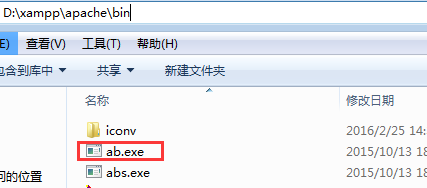
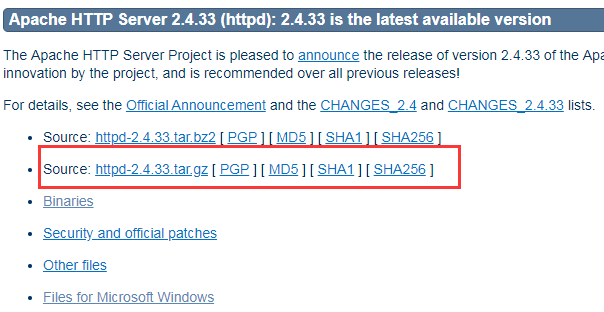
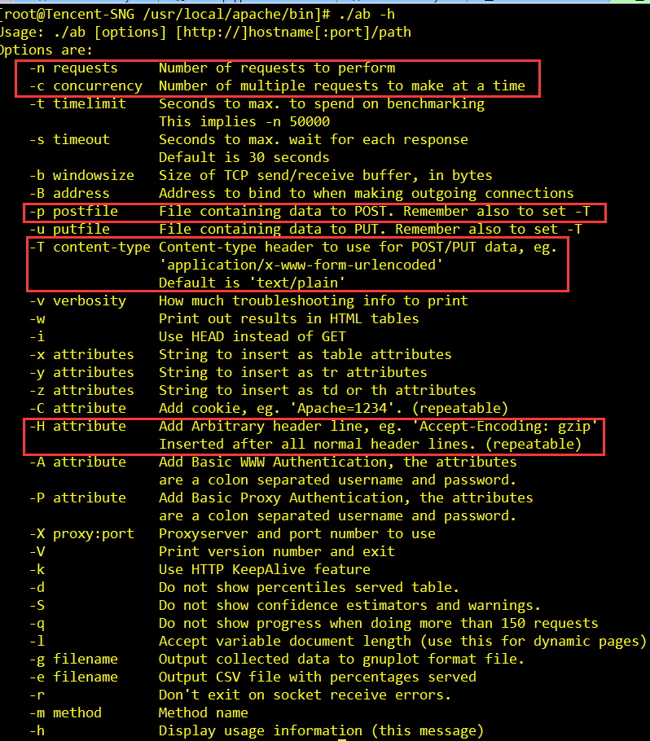

# 压测工具 - Apache ab

Apache ab全称ApacheBench，有Apache提供的一个轻量级压测工具，windows、linux下均有对应版本。

## 安装方法

#### windows

到[Apache Http Server](https://httpd.apache.org/download.cgi#apache24https://httpd.apache.org/download.cgi#apache24)官网下载集成软件包 [XAMPP](http://www.apachefriends.org/en/xampp.html) 或 [WampServer](http://www.wampserver.com/)。安装完成后，在`%installPath%/apache/bin`找到ab.exe。



#### linux

到[Apache Http Server](https://httpd.apache.org/download.cgi#apache24https://httpd.apache.org/download.cgi#apache24)官网下载下载`httpd-{version}.tar.gz`包进行源码安装。安装完毕后在`%installPath%/apache/bin`找到ab。



## 使用方法

以linux下ab为例，windows使用同理。

### ab命令参数



上图红框标记为ab常用参数，含义如下：

- `-n` 请求总数。
- `-c` 并发数。
- `-H` 添加任意Http请求头，包括cookie、user agent等，可添加多个。
- `-p` 当压测post请求时，指定post数据文件路径。
- `-T` 当压测post请求时，指定post数据格式，`application/json`或`application/x-www-form-urlencoded`。

### 实战使用

压测对象为鹅漫U品页面和cgi。

#### 样例1 - 压测GET请求

```bash
./ab -c 800 -n 10000 -k -H "Cookie: uin=o0502383519; skey=@P1crrtHu7;" -H "Accept-Encoding: gzip, deflate"  "http://mall.vip.qq.com/?debug=1&mqqRelogin=false"
```

http://mall.vip.qq.com/?debug=1&mqqRelogin=false 页面从cookie中取出参数校验用户登录态，故通过`-H`参数指定用户cookie。另一`-H`参数则指定了客户端可接收编码格式gzip，目的让Server对响应数据进行压缩。  
`-k`即在http请求头插入`Connection: keep-alive`。命令共模拟800个用户同时请求页面10000次。

#### 样例2 - 压测POST请求

```bash
./ab -T "application/json;charset=UTF-8" -H "User-Agent: Mozilla/5.0 (iPhone; CPU iPhone OS 9_1 like Mac OS X) AppleWebKit/601.1.46 (KHTML, like Gecko) Version/4.0 Chrome/37.0.0.0 Mobile MQQBrowser/6.8 TBS/036823 Safari/537.36 V1_AND_SQ_6.5.3_398_YYB_D QQ/6.5.3.2855 NetType/WIFI WebP/0.3.0 Pixel/1080" -p post.json -c 800 -n 10000 "http://uapi.vip.qq.com/Api/api.brand.condition" 
```

通过`-T`参数指定了post请求参数编码格式为`application/json`，`-p`指定post请求参数文件路径post.json，post.json文件内容如下。

```json
{"brand_id": 16, "page": 1, "per_page": 10}
```


