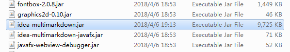
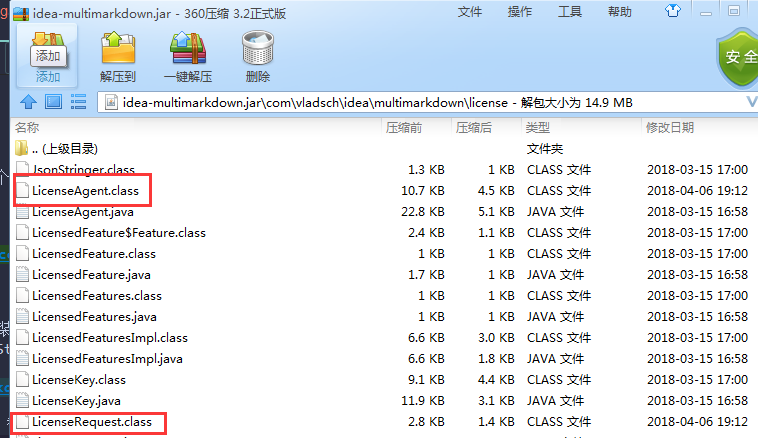
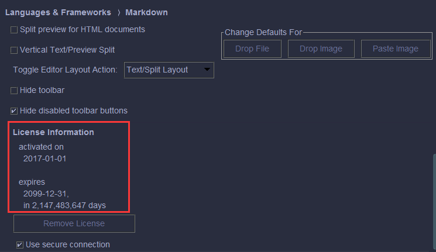

# PhpStorm插件之Markdown-Navigator

## 简介

Markdown-Navigator可谓是PhpStrom内置markdown插件的升级版，支持更多工具快捷方式和功能点，如：
1. 加强版工具栏
2. 粗体
3. 斜体
4. 删除线
5. 行内代码高亮
6. 插入链接
7. 有序无序列表
8. 任务列表
9. 插入表格，插入删除行、列
10. 格式化表格
11. 格式换文档

## 问题

默认下载版本是付费的，作为一个普通码农> <，希望有能力的都支持正版。

## 破解方案

1.到[此处](https://github.com/CrazyBunQnQ/multimarkdown)下载两个class文件。
>LicenseAgent.class  
>LicenseRequest.class

2.找到Markdown-Navigator安装目录下的`idea-multimarkdown.jar`。
>C:/Users/{username}/.PhpStorm2018.1/config/plugins/idea-multimarkdown/lib

3.用压缩软件不解压打开jar包，替换上面两个class文件。

4.重启PhpStorm即可，此时Markdown-Navigator插件已破解，所有功能开启。

